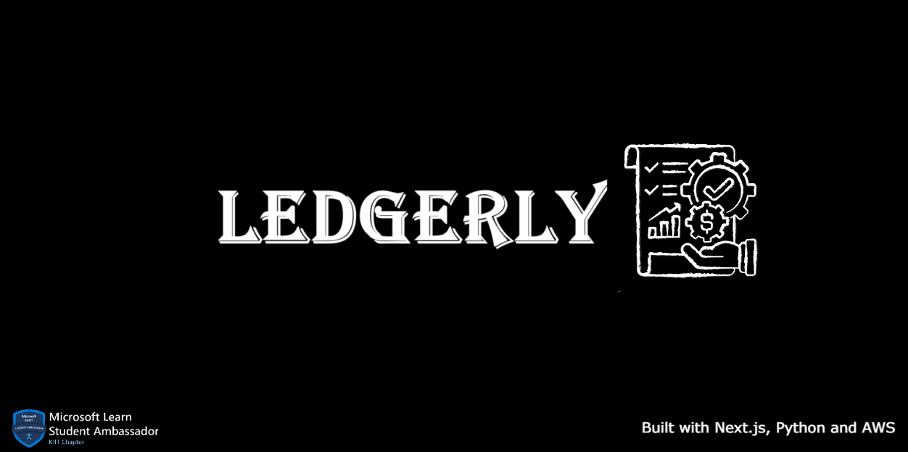
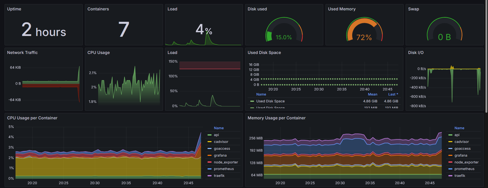
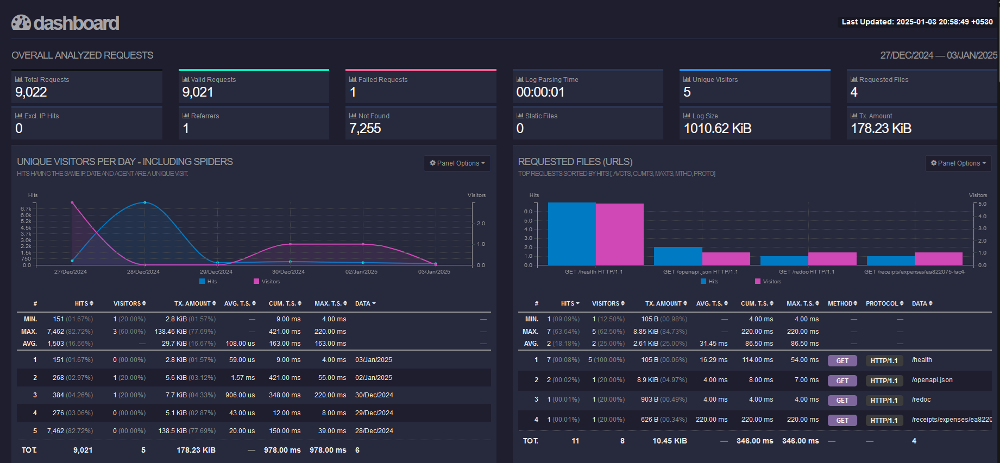

<h1 align="center">Ledgerly</h1>

<p align="center">
  An open source, self hostable expense tracking platform built with NextJS, Python<br>
  and AWS for the Lambda functions and S3 object storage.<br>Manage and gain insights from your expenses.
</p>

<p align="center">
  <a href="#features"><strong>Features</strong></a> ·
  <a href="#overview"><strong>Overview</strong></a> ·
  <a href="#aws-setup"><strong>AWS Setup</strong></a> ·
  <a href="#remote-backend-setup"><strong>Backend Setup</strong></a> ·
  <a href="#usage"><strong>Usage</strong></a> ·
  <a href="#monitoring"><strong>Monitoring</strong></a> ·
  <a href="#authors"><strong>Authors</strong></a>
</p>

## Features

- **Website**
  - [NextJS](https://nextjs.org) App Router
  - [Amazon Web Services](https://docs.aws.amazon.com/) for backend functionality with `EC2`
  - Support for `S3` File Storage, and `Lambda` Container image based Functions
  - Edge runtime-ready
  
- **AWS Infrastructure**
  - [Amazon S3](https://aws.amazon.com/s3) Utilized for image storage.
  - [AWS Lambda](https://aws.amazon.com/lambda) for processing JSON and filtering required data
  - [Amazon EC2](https://aws.amazon.com/sns) for provisioning VM instances 
  - [Amazon ECR](https://aws.amazon.com/ecr) for privately hosting container images 

- **External**
  - [Prometheus](https://prometheus.io/docs/introduction/overview/), [Grafana](https://grafana.com/docs/grafana/latest/) and [GoAccess](https://goaccess.io/) for extensive observability and monitoring of resources. 
  - [Gemini API](https://ai.google.dev/gemini-api/docs) for image to text extraction using Vision Model within free tier limits.
  - [Github Actions](https://github.com/features/actions) CI pipelines to build, test and push application images from Github to various registries.
  - [Traefik](https://doc.traefik.io/) acts as a dynamic reverse proxy and automatically manages SSL/TLS certificates

### Tech Stack


## Overview


- The **backend** consists of 3 main services being the **Python based REST API** developed using **FastAPI** for serving requests, performing CRUD operations, a **RDS Postgres** database for data storage and retrieval and a **S3 Bucket** for image storage and hosting.
- The other 5 services consist of **Traefik** as reverse proxy, utilized for automatic SSL provision, log creation and **Prometheus**, **Grafana** for resource usage collection and visualization using custom **log exporters**.
- All of these services are run using **Docker** containers to ensure availability and performance.

## Project Structure

```
.
├── README.md
├── assets
│   ├── arch.png
│   ├── banner.png
│   ├── er.png
│   ├── goaccess.png
│   ├── grafana.png
│   ├── inboundrules.png
│   └── lambda-uri.png
├── docker-compose.yml
├── monitoring
│   ├── grafana
│   │   └── datasources.yml
│   └── prometheus
│       └── prometheus.yaml
└── services
    ├── backend
    │   ├── Dockerfile
    │   ├── app
    │   │   ├── __init__.py
    │   │   ├── app.py
    │   │   ├── core
    │   │   │   ├── __init__.py
    │   │   │   ├── config.py
    │   │   │   ├── db.py
    │   │   │   └── utils.py
    │   │   ├── db
    │   │   │   ├── __init__.py
    │   │   │   └── models.py
    │   │   ├── main.py
    │   │   └── routers
    │   │       ├── __init__.py
    │   │       ├── auth.py
    │   │       ├── deps.py
    │   │       └── receipts.py
    │   ├── pyproject.toml
    │   └── uv.lock
    ├── ledgerly.sql
    └── receipt-ocr
        ├── Dockerfile
        └── app.py

12 directories, 30 files
```

Primary Services:
- `services/backend:` This subdirectory consists of the primary backend API for the entire application facilitating user registration, login, image upload and CRUD operations with the database.
- `services/receipt-ocr:` This subdirectory consists of the helper application which extracts relevant data using an LLM from user submitted receipt images and adds these records into the database.
- `monitoring/:` This folder consists of all configurations required for the monitoring systems in place.

# AWS Setup

> [!NOTE]  
> The default architecture is based on AWS services, however all of the services and tooling can be setup within any other cloud platform of choice or self hosted locally as well if required.

All the services except S3 must be setup within the same region in AWS. 

All the services and configurations below adhere to the `AWS Free Tier` for a brand new account upto 12 months.

## ECR

AWS Elastic Container Registry will be used to host the container images to be run on AWS Lambda.

> [!NOTE]  
> AWS Lambda can only run images hosted on private registries in ECR.

- Go to Private registry > Repositories > Create Repository.
- Provide a repo namespace and name and keep the rest as default
- Once the repository is created, select it from the Repositories and go to Actions > Permissions.
- Under Permissions click on Edit Policy JSON and paste the below policy.

```json
{
  "Version": "2012-10-17",
  "Statement": [
    {
      "Sid": "LambdaECRImageRetrievalPolicy",
      "Effect": "Allow",
      "Principal": {
        "Service": "lambda.amazonaws.com"
      },
      "Action": [
        "ecr:BatchGetImage",
        "ecr:GetDownloadUrlForLayer"
      ]
    }
  ]
}

```
- On the Repositories tab and note View push commands for the respective platform to use with Docker during local development.
- Build the image for `services/receipt-ocr` using Docker locally with the tag `latest` and push it to the ECR repository just created.

## RDS

AWS RDS with PostgreSQL will serve as the primary database for storing user and receipt data for our application.

- Go to Databases > Create Database > Standard Create.
- Select PostgreSQL. Under Engine Version, choose PostgreSQL 17.2-R1.
- Under Templates, choose Free Tier.
- Under Settings, provide a name for the database under DB Instance identifier. 
- Create the Master Username and Master Password.
- Under Connectivity, choose Yes under Public Access
- Choose Create new under VPC Security Group (firewall) and provide a name.

Database Connection Endpoint: `[database-name].abcdef123456.[region].rds.amazonaws.com`


## Lambda

AWS Lambda will be used for running the container image for the `services/receipt-ocr` application in a serverless environment.

- Create a Function > Container Image.
- Provide a function name. Under Container Image URI > Browse Images choose the ECR repository created earlier and select the image tagged as latest.

  

- Under architecture choose x86_64 and leave the rest as default. Choose Create function.

### Configuration

Under General configuration change the defaults as below:
  - `Memory` - 512MB
  - `Timeout` - 30 sec

### Permissions

- Under Permissions > Execution Role Name, click the role to redirect to IAM. 
- In the IAM console, under Permission Policies > Add Permissions > Create Inline Policies.
Switch to JSON mode and paste the below policy. Then click Create.

  ```json
  {
      "Version": "2012-10-17",
      "Statement": [
          {
              "Sid": "VisualEditor0",
              "Effect": "Allow",
              "Action": [
                  "s3:GetObjectAcl",
                  "s3:GetObject",
                  "s3:GetObjectAttributes"
              ],
              "Resource": [
                  "arn:aws:s3:*:replace-account-id:accesspoint/*",
                  "arn:aws:s3:::replace-bucket-name/*"
              ]
          }
      ]
  }
  ```
- Again, go to Add Permissions > Attach policies. 
- Choose `AWSLambdaVPCAccessExecutionPermissions` from the list > Add permissions. 

### Environment

Go to Environment Variables > Edit. Add the following variables required by the application.

- `API_KEY` - [Gemini API KEY]
- `DB_HOST` - [Connection String for the Database (RDS/Docker/etc)]
- `DB_PASS` - [Database Password]
- `DB_USER` - [Database Username]
- `S3_ENDPOINT` - [S3 Bucket URL of the form https://bucket-name.s3.region.amazonaws.com/]

## S3

AWS S3 will be utilized for encrypted storage and hosting of user's receipt images.

- Create a new bucket. Choose a name and select ACLs enabled under Object Ownership.
- Under Block all public settings for this bucket, disable Block All public Access.
- After bucket creation, go to Properties > Event Notifications > Create Event Notification.
- Provide a name and under Event Types, choose All object create events.
- Under Destination select Lambda function > Choose from your Lambda functions > Select the function created in <a href="#lambda">Lambda</a> section.

## EC2

AWS EC2 will be used for provisioning a virtual machine for running Docker containers of the application and various services.

Go to Instances > Launch Instances. Create an EC2 instance with the following specs:

- `OS Image:` Ubuntu Server 24.04 LTS (64-bit x86)
- `Instance Type:` t2.micro
- `Key Pair:` Create a new .pem key to use with OpenSSH locally
- `VPC:` default
- `Security Group:` Allow SSH from Anywhere
- `Storage:` 15GB

Once the Instance is Running and passed all system reachability checks, select Instance > Security > Security Details.

### Inbound Rules

- Go to Security Groups > Inbound Rules > Edit Inbound Rules.
- Add the below rules and click Save Rules.

  

### IAM Role

- Go to Instances > Actions > Security > Modify IAM Role > Create New IAM Role.
- Under Create Role choose AWS Service as Trusted Entity Type and EC2 under Use case.
- Under Permissions select `AmazonS3FullAccess`. Provide a role name and choose Create Role.
- Go back to Modify IAM Role > Choose the Role just created above from IAM role dropdown > Click Update IAM role.
---

# Remote Backend Setup

1. Install git. Clone the repository and move the contents of the `monitoring/` folder into the EC2 machine.

```bash
mkdir backend
git clone https://github.com/sourasishbasu/ledgerly.git
mv $HOME/ledgerly/monitoring/* $HOME/ledgerly/docker-compose.yml $HOME/backend
```

2. Create the logs folder and secrets file. Copy contents of `services/backend/env.example` and replace secrets and endpoints into the `.env` file.

```bash
cd backend
mkdir logs
touch .env
```
3. Install [Docker on Ubuntu](https://docs.docker.com/engine/install/ubuntu/).

## Database

The default architecture utilizes the free `AWS RDS t4g.micro` instance for hosting the Postgres database. As an alternative a `postgres` container can also be run within `Docker` on an `EC2` machine for the same utility. 

### Default Credentials
`username` - user

`pass` - pass

`DB Name` - testdb

`port` - 5432

`host` - EC2 public IP or RDS Connection URL

### Creating tables


Copy the contents of `services/ledgerly.sql` into the SQL Query Editor within any database tool used for connecting to the postgres container.

## Traefik

Traefik serves as a **reverse proxy** to route HTTP requests to the appropriate backend services. 


- Traefik automatically **detects and routes traffic** to Docker services. Services must explicitly enable routing via labels, ensuring only intended services are exposed within the `Docker Compose` specification.

- **Web traffic** is routed through an HTTP entrypoint on port 80. The API service listens internally on port 5000, which Traefik uses to forward incoming requests.

- **Access logs** are enabled and stored in the ./logs/traefik-access.log file, used by `GoAccess` to create the dashboard

- Handle **HTTPS** for the application by integrating with `Let's Encrypt` for automatic certificate management, simplifying secure communication for all exposed services.

## Monitoring

The Ledgerly backend includes a comprehensive monitoring setup using metrics' exporters, Prometheus and Grafana. This allows user to collect metrics, visualize data, and set up alerts for your application.

> [!NOTE]  
> Due to infrastructure limitations, all monitoring tools are being setup on the same machine as the application services however this deviates from best practices and is not recommended in production.

### Exporters

Services which collect and expose system and application metrics from specific resources or environments, making them available in a format that monitoring and observability systems such as Prometheus can scrape and process.

- **Node Exporter**: Used for collectin hardware and OS-level metrics from a Linux server such as Disk I/O, CPU, Memory usage etc.

- **cAdvisor**: Used for monitoring resource usage and performance metrics for containers.

### Prometheus

Prometheus is used to scrape and store metrics from various endpoints. The configuration for Prometheus is located in `monitoring/prometheus/prometheus.yaml`.

```bash
hostname -I # Host Private IP
```

Replace EC2 instance's private IP into `backend/prometheus/prometheus.yml` under `node_exporter` and `cAdvisor` job's targets.

```yaml
scrape_configs:
  - job_name: node_exporter
    static_configs:
      - targets: ["<instance-private-ip>:9100"]
```

### Grafana

Grafana is used to visualize the metrics collected by Prometheus. The configuration for Grafana datasources is located in `monitoring/grafana/datasources.yml`.

- Login to Grafana website. Go to Dashboards > New > Import
- Go to Import Dashboard with ID. Enter `16310` > Load
- Select Main (Prometheus) as the Data Source if prompted.

### Default Credentials
`username` - admin

`pass` - projectwing

Grafana Dashboard URL: `http://<instance-public-ip>:3000`



### GoAccess

Generates an extremely detailed real time HTML report of web traffic of an API such as visitors, hits, geolocation etc.

#### Credentials

`username` - admin

`pass` - projectwing

GoAccess Dashboard URL: `http://<instance-public-ip>:7880`



# Usage

**Set up AWS credentials**:
   Ensure you have your AWS credentials configured. You can do this by setting environment variables or using the AWS CLI.

Run the containers with `Docker Compose`.

```
docker compose up --build --pull missing -d
```

Once the Docker container is up, API will be accessible at `http://<instance-public-ipv4-dns>`.

> [!NOTE]
> Detailed API docs along with examples and template data can be found at [Scalar Docs](https://expense-tracker.apidocumentation.com/).


## Expected Result

```bash
$ docker compose ps
NAME            IMAGE                                              COMMAND                  SERVICE         CREATED        STATUS                    PORTS
api             ghcr.io/sourasishbasu/expense-tracker-api:latest   "fastapi run app/mai…"   api             24 hours ago   Up 10 minutes (healthy)   5000/tcp
cadvisor        gcr.io/cadvisor/cadvisor:latest                    "/usr/bin/cadvisor -…"   cadvisor        24 hours ago   Up 10 minutes (healthy)   0.0.0.0:8090->8080/tcp, [::]:8090->8080/tcp
goaccess        xavierh/goaccess-for-nginxproxymanager:latest      "tini -- /goan/start…"   goaccess        24 hours ago   Up 10 minutes             0.0.0.0:7880->7880/tcp, :::7880->7880/tcp
grafana         grafana/grafana-oss:11.4.0                         "/run.sh"                grafana         24 hours ago   Up 10 minutes             0.0.0.0:3000->3000/tcp, :::3000->3000/tcp
node_exporter   quay.io/prometheus/node-exporter:latest            "/bin/node_exporter …"   node_exporter   24 hours ago   Up 10 minutes
prometheus      prom/prometheus:latest                             "/bin/prometheus --c…"   prometheus      24 hours ago   Up 10 minutes             0.0.0.0:9090->9090/tcp, :::9090->9090/tcp
traefik         traefik:latest                                     "/entrypoint.sh --ap…"   traefik         24 hours ago   Up 10 minutes             0.0.0.0:80->80/tcp, :::80->80/tcp, 0.0.0.0:8080->8080/tcp, :::8080->8080/tcp
```

## Authors

This project was made for Project Wing 2025 by [MLSAKIIT](https://mlsakiit.com/).

- Sourasish Basu ([@SourasishBasu](https://github.com/SourasishBasu)) - [MLSA KIIT](https://mlsakiit.com)

## Version
| Version | Date          		| Comments        |
| ------- | ------------------- | --------------- |
| 1.0     | Dec 29th, 2024   | Initial release |